# Сайт по Kinopoisk Unofficial API

- Для запуска приложения необходимо: 
  - склонировать репозиторий
  - перейти в корневую папку репозитория
  - ввести в терминале "yarn install", дождаться установки пакетов
  - ввести "yarn start"
- Для запуски через Docker:
  - склонировать репозиторий
  - перейти в корневую папку репозитория
  - ввести в терминале "docker build -t vne-server ." (где "vne-server" - название образа)
  - в Docker Dekstop запустить контейнер для данного образа

------

1. Для начала работы необходимо ввести токен, который можно получить после регистрации на [kinopoiskapiunofficial]().

   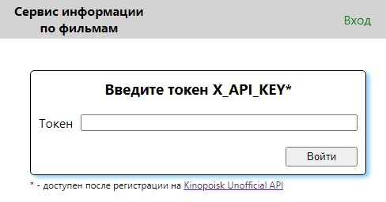

2. После входа будет осуществлён переход на страницу информации по фильму, доступной по Kinopoisk ID.

   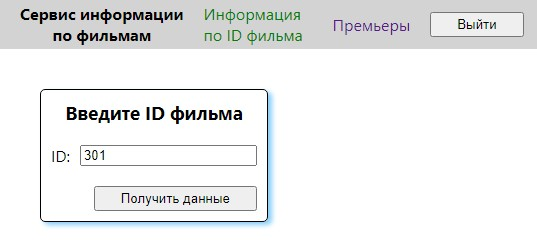

3. Пример карточки фильма:

   ​	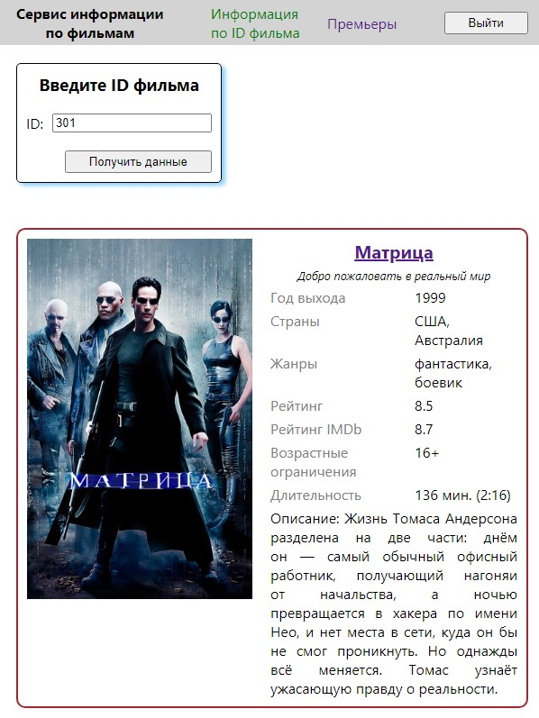

4. При следующем запросе - новые карточки фильмов будут отображаться в начале страницы:

   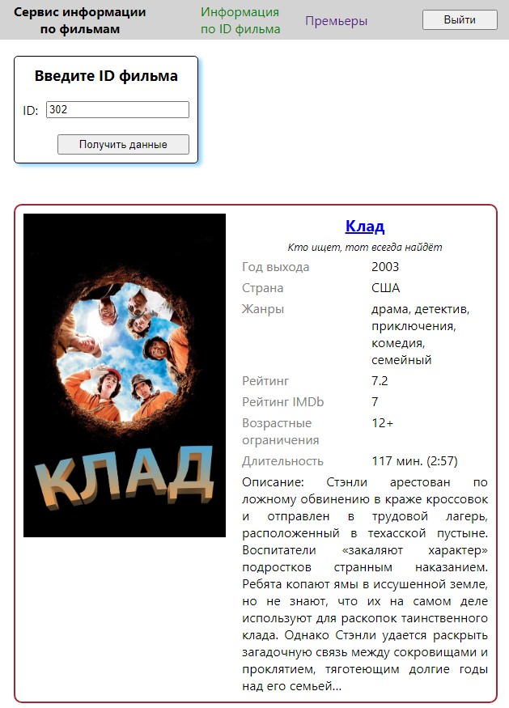

5. При некорректном токене - будет выводиться соответствующая ошибка:

   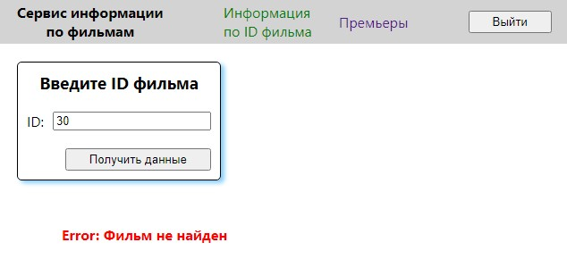

6. Пример вывода ошибки, неуказанной в документации на сайте:

   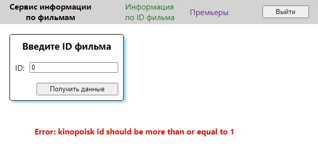

7. После переходе на страницу премьер необходимо выбрать период премьер - год и месяц:

   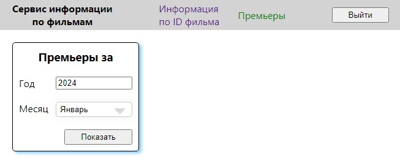

8. Вывод премьер осуществляется в слайдер:

   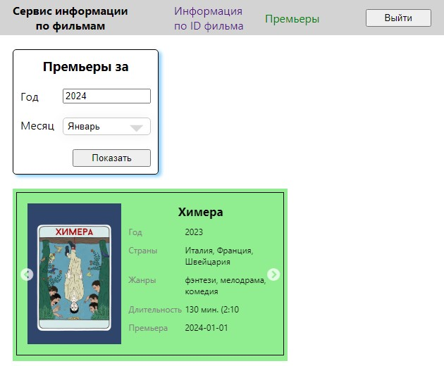

9. При увеличении области просмотра - будет увеличиватсья количество выводимых элементов в слайдере:

   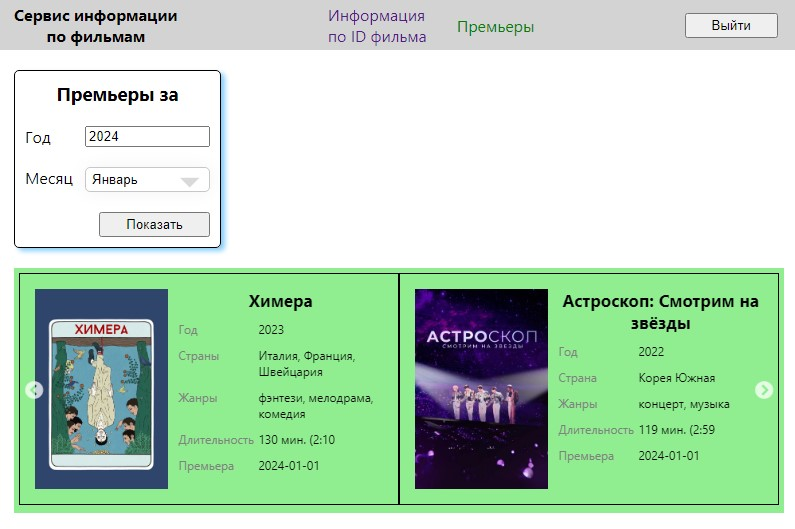
   
10. Можно изменить используемый токен, нажав на кнопку "выйти" - появится модальное окно в середине видимой области:

    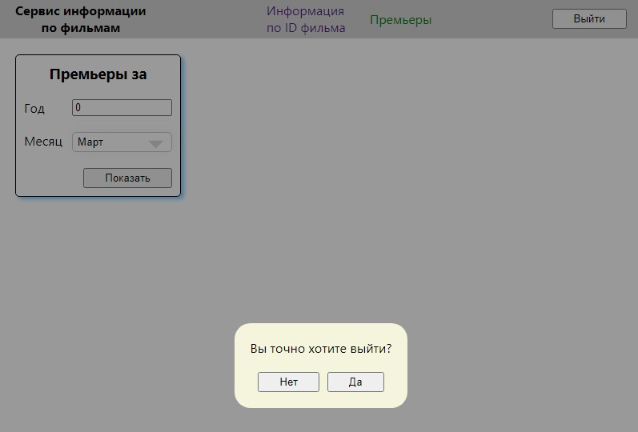

11. Если ввести некорректный токен и попробовать осуществить запрос - также будет выводиться модальное окно с соответствующим сообщением:

    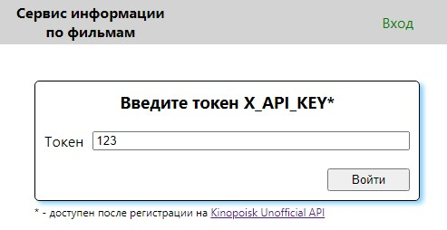

    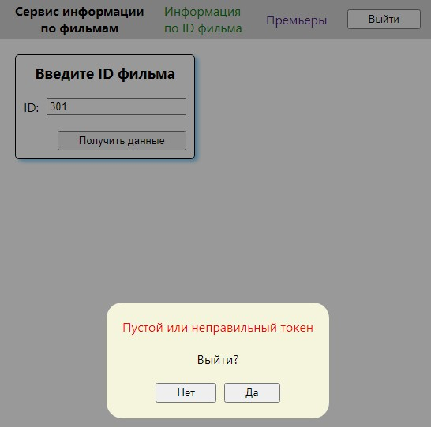

